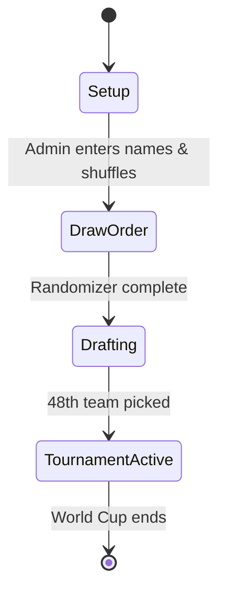

# Technical Specification: World Cup Country Draft

This document outlines the system architecture, database design, visual states, and algorithms for the World Cup Country Draft application.

---

## 1. System States & Transitions
The application has three distinct lifecycle phases, governed by a state variable (`Config!DraftStatus`):



### State 1: Setup
* Admin inputs player names in the Google Sheet.
* System initializes database structures.

### State 2: Draw Order (Capsules Screen)
* Displays a glass bowl with 5-8 golden spheres.
* Clicking a ball triggers:
  1. Frontend sends ID to backend: `google.script.run.drawCapsule(ballId)`
  2. Backend shuffles remaining undrawn names, marks a name as drawn, and saves it to the `Draft` sheet.
  3. Frontend animates the capsule opening, revealing the name.
* Once the last ball is opened, a "Proceed to Draft Room" button appears.

### State 3: Drafting (Draft Room Screen)
* Displays the pots columns containing circular country flags.
* Shows active player, next-in-line ticker, and **Draft Rules Banner**.
* Implements the **Group Lock Algorithm**:
  1. Before rendering flags, check the list of groups the active player has already drafted from.
  2. If the active player has already selected a country from Group X, disable all other countries in Group X on their screen.
  3. *Exception:* If the only remaining available countries in the draft pool are in groups the active player already owns, bypass the disable rule (keeps the draft from breaking).
* Selecting a country assigns it to the active player in the sheet and advances the draft pointer.
* Once 48 picks are completed, state transitions automatically to `TournamentActive`.

### State 4: Tournament Active (Dashboard Screen)
* Web app defaults to the **Leaderboard** and **Match Centre** tabs.
* Background triggers run every 15 minutes to pull match updates and recalculate scores.

---

## 2. Google Sheets Database Schema

### Sheet 1: `Config`
* Core settings: `DraftStatus` (Setup / Draw / Draft / Active), `Passcode`, `LastUpdated`.
* Player list and their randomized Pick Numbers.

### Sheet 3: `Teams`
* Preloaded list of 48 countries:
  * `CountryName`, `FlagCode`, `GroupLetter`, `FIFA_Rank`, `Tier` (1-4), `Multiplier` (1.0 / 1.25 / 1.6 / 2.0), `Owner`, `Wins`, `Draws`, `Goals`, `CurrentStage`, `PointsContributed`.

### Sheet 4: `Matches`
* Cached tournament match data:
  * `MatchID`, `Stage`, `TeamA`, `TeamB`, `ScoreA`, `ScoreB`, `Winner`, `Status` (Scheduled/Live/FT), `ShootoutWinner`, `Date`.

---

## 3. UI/UX Design & Styling Specifications

### Visual Assets & Flags
* **Flags:** Rendered as clean, high-resolution circular icons using CSS clip-path or public SVGs (e.g. `https://flagcdn.com/w80/{code}.png` loaded into a circular border-radius container).
* **Golden Capsules:** CSS animations simulating a 3D glass bowl. On click, the capsule splits in half with a simple transition, revealing a paper slip.

### Draft Rules Banner
A sticky side panel or drop-down banner displaying:
```text
DRAFT RULES:
1. Snake Draft Order: Player 1 -> 4, then Player 4 -> 1.
2. Group Lock Rule: You cannot draft two countries from the same Group (A-L) unless you have no other choice.
3. Points Multipliers: T1 = 1.0x | T2 = 1.25x | T3 = 1.6x | T4 = 2.0x
```

### Match Card Structure (Player vs. Player focus)
```html
<div class="match-card head-to-head">
  <div class="match-header">
    <span class="player-name">Dave</span>
    <span class="vs-badge">VS</span>
    <span class="player-name">Sarah</span>
  </div>
  <div class="match-body">
    <div class="team-team">
      
      <span>England (1.0x)</span>
    </div>
    <div class="match-score">2 - 1</div>
    <div class="team-team">
      
      <span>Morocco (1.25x)</span>
    </div>
  </div>
  <div class="match-status live">LIVE 78'</div>
</div>
```
